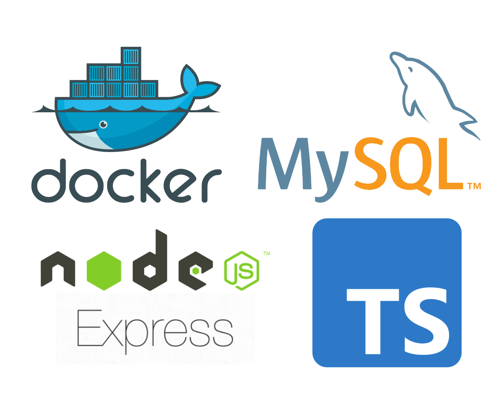

<p align="center">
  
</p>

<p align="center">
  <a href="http://makeapullrequest.com">
    
  </a>
  <a href="https://opensource.org/licenses/MIT">
    
  </a>
</p>

[English](./README.md)  | 한국어

## 소개

- 도커 컴포즈를 이용해 Express + Typescript 어플리케이션을 Mysql 데이터베이스와 연결한다.
- 로컬 타입스크립트 소스코드가 변경되면 컨테이너 내부에서 서버를 재시작한다.
- 예제 코드로 데이터베이스가 연동된 간단한 메모장 API 서버를 제공한다. 

## 실행 방법

1. 저장소를 `clone` 한다.
2. `.env.example` 을 `.env` 로 파일 이름을 변경한다.
3. 아래 명령어를 실행한다.
    ```
    docker-compose up
    ``` 

## 기타

컴포즈 로그 확인
```
docker-compose logs app
docker-compose logs db
```
Mysql 컨테이너에 접속해 터미널 열기
```
docker exec -it db bin/sh
mysql -u root -p 
```
`compose up` 명령어로 띄웠던 컨테이너와 연결된 networks, volumes, images 종료 및 삭제 
```
docker-compose down
```
이미지 다시 빌드 후 컨테이너 시작
```
docker-compose up --build
```

## 프로젝트 구조

```bash
├── public/                    # README 파일 로고
├── src/                       # 프로젝트 소스코드 폴더
│   ├── interfaces             # 타입스크립트 인터페이스
│   ├── database.ts            # 데이터 베이스 관련 파일
│   ├── app.ts                 # express 애플리케이션 
│   └── server.ts              # 서버 시작 부분 
├── requests.rest              # 테스트용 rest 요청
├── my.cnf                     # mysql 설정
├── setup.sql                  # 데이터베이스 파일 
├── start.sh                   # express 애플리케이션 시작 스크립트 
├── Dockerfile.dev             # express 애플리케이션 빌드용 도커파일
├── docker-compose.yml         # 도커 컴포즈 파일
├── .env.example               # 환경변수 관리파일 
├── package-lock.json          # 패키지 lock 파일
├── package.json               # 패키지 설정 파일
└── tsconfig.json              # 타입스크립트 설정
```

## HTTP 요청에 따른 응답

<a href="https://marketplace.visualstudio.com/items?itemName=humao.rest-client">REST Client</a> 를 사용해 프론트엔드 없이 API 요청을 서버에 전송한다. 만약 다른 방법으로 하고 싶다면 <a href="https://www.postman.com/ ">Postman</a> 등을 이용할 수 있다.
```yaml
GET http://localhost:3000/api/memo

### 
POST http://localhost:3000/api/memo
content-type: application/json

{
    "content": "default memo"
}

###
PUT  http://localhost:3000/api/memo
content-type: application/json

{
    "id" : 1,
    "newContent" : "modified memo"
}
###
DELETE http://localhost:3000/api/memo
content-type: application/json

{
    "id" : "1"
}
```
 
